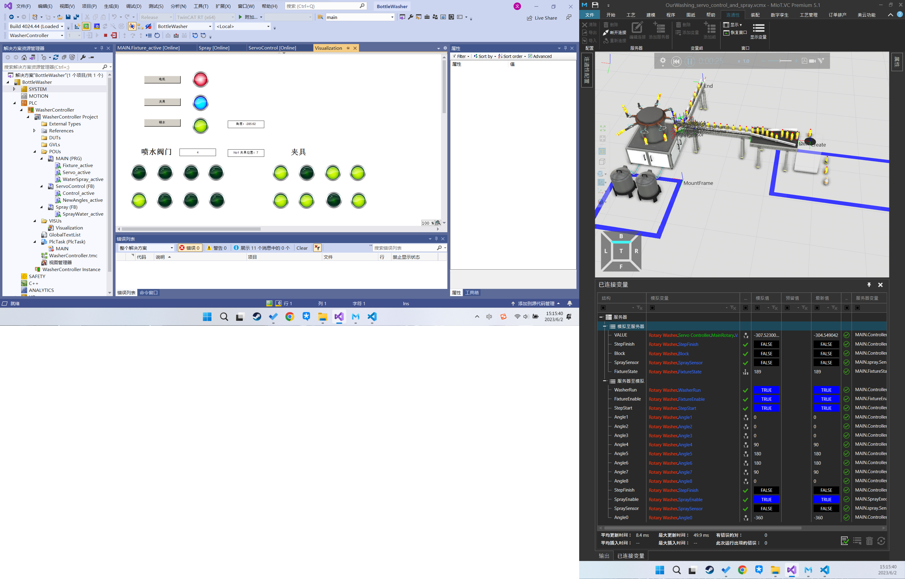
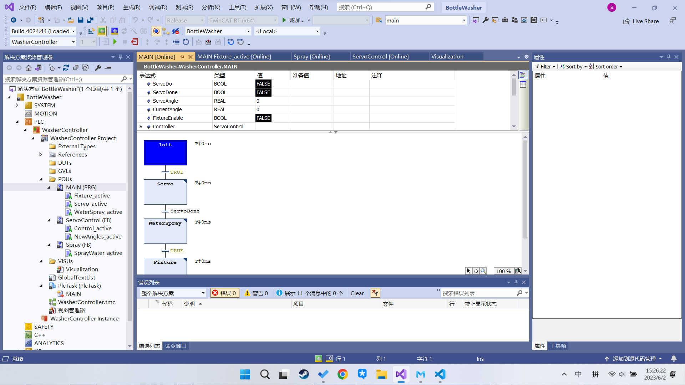
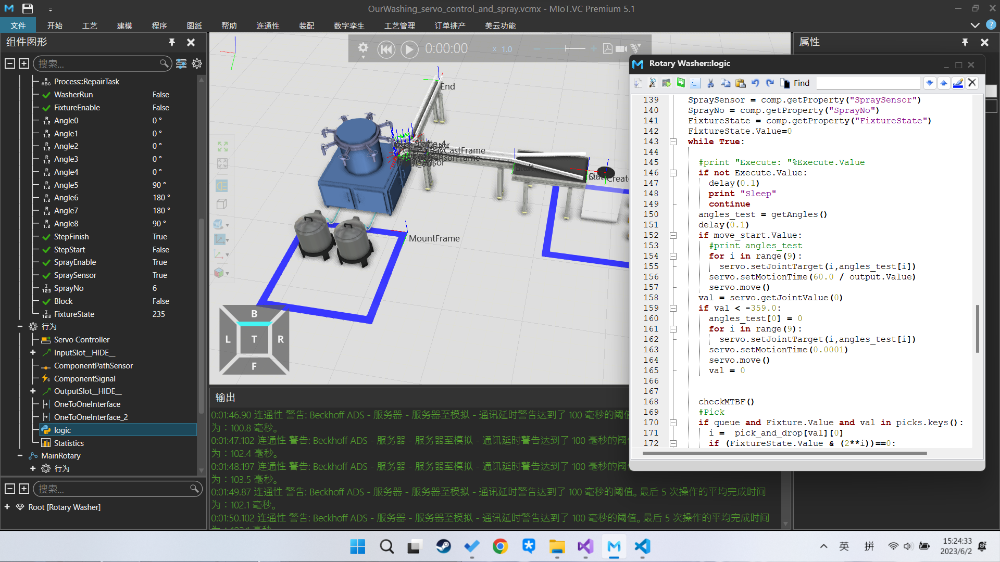

# Battle Washer: PLC Control and Simulation

[仿真演示视频](media/Demo.mkv "Demo")

该项目包含两个子项目：

TwinCat PLC 代码控制和Runtine、ADS等部件，以及用于和物理仿真的MIot环境。

前者使用顺序关系图搭建总体框架，使用结构化文本实现逻辑控制和检测。

仿真环境包含流水线的物理建模、属性行为和逻辑控制等部分。逻辑控制通过python脚本实现。

Twincat：

MIot:

    Python和ADS(TwinCat PLC通讯)通过读取和写入模型属性控制模型旋转、夹取、停止等操作。
